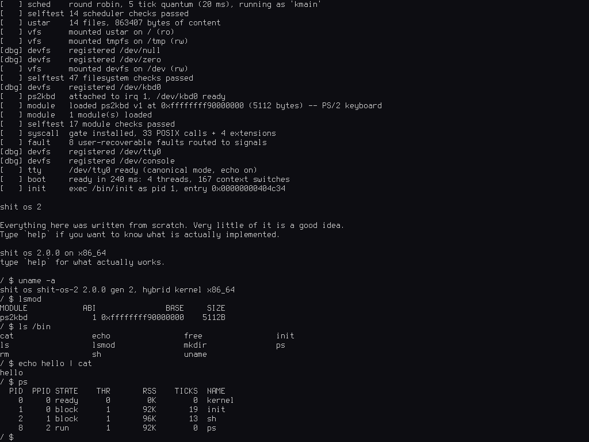
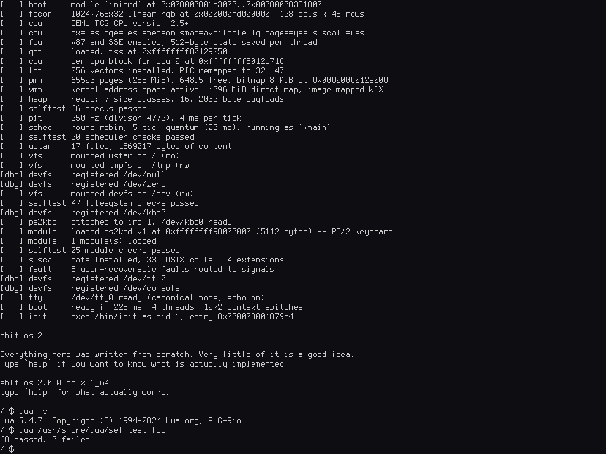
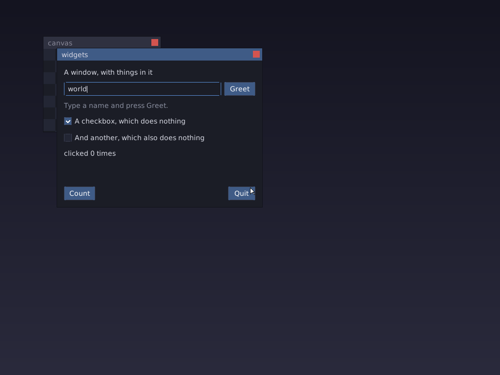
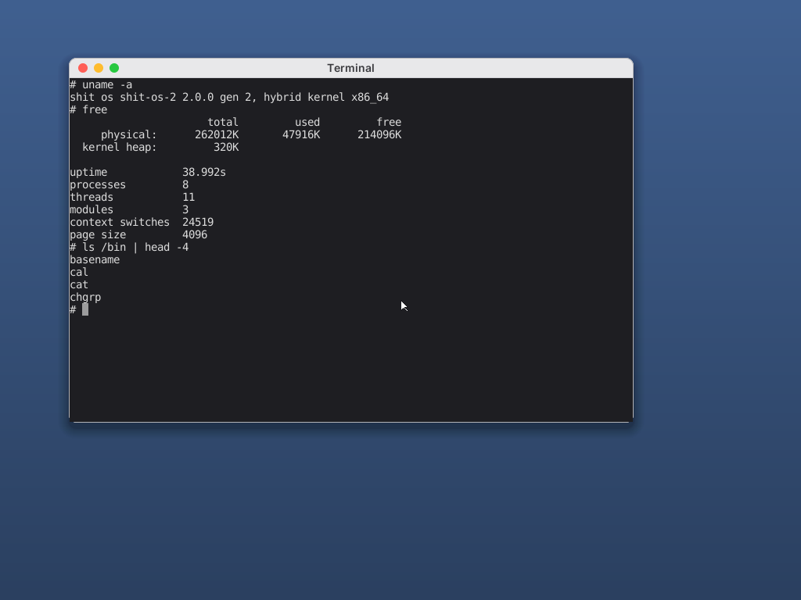

<div align="center">

# shit os 2

**A hybrid x86-64 operating system, written from scratch.**
Not based on Linux. Not based on much else either.

</div>



---

Gen 1 was a 900-line 32-bit toy: no interrupts, no paging, no processes, and a
blue screen whenever anything at all went wrong. Gen 2 is a different animal.
It boots on real firmware through GRUB, runs in long mode at `-2 GiB`, loads
drivers at runtime against a versioned ABI, and reaches an interactive shell in
ring 3 with a C library written for it.

It is still not useful. It is now genuinely an operating system.

## What works

| | |
|---|---|
| **Boot** | Multiboot2 via GRUB, 32-bit trampoline into long mode, higher-half kernel, ISO built by `grub-mkrescue` |
| **CPU** | GDT/TSS, 256-vector IDT, named exceptions, 8259 with shared IRQ chains, CR0.WP + SMEP + NX |
| **Memory** | Bitmap physical allocator, 4-level paging, W^X kernel image, 4 GiB direct map, MMIO and module windows, slab-backed kernel heap |
| **Scheduling** | Preemptive round-robin at 250 Hz, per-CPU run queue behind a `gs` accessor, wait queues, sleeping, zombie reaping |
| **Filesystems** | VFS over a ustar initrd (ro), tmpfs, devfs |
| **Graphics** | `/dev/fb0` mapped straight into a process, `/dev/mouse0`, `/dev/kbdraw` with press and release events |
| **Desktop** | A window server in userland: real windows, titlebars, dragging, stacking, focus, click-to-raise. Clients draw into shared memory, so no pixel is ever sent as a message |
| **Toolkit** | Our own TrueType rasteriser, and a retained-mode widget library on top of it: boxes that lay out, labels, buttons, checkboxes, text fields, hover and focus, anti-aliased rounded rectangles and shadows |
| **Terminal** | Pseudo-terminals, a controlling terminal per session with a real `/dev/tty`, and a VT100 emulator as a widget: colour, cursor addressing, erase, 2000 lines of scrollback. `dash` runs in a window |
| **Modules** | ELF64 `.ko` loaded at runtime against a versioned ABI; PS/2 keyboard, PS/2 mouse and CMOS clock drivers, written in C |
| **Userland** | Ring 3, 51 POSIX syscalls, static ELF loading with a correct auxv, `fork`/`execve`/`waitpid`, pipes, signals with masking, `poll`/`select`, the `at` family, job control with process groups and sessions, a TTY with canonical line discipline, pseudo-terminals |
| **libc** | Our own: stdio, an allocator that is not linear in the heap, a libm checked in ULPs, and a POSIX regex engine |
| **Programs** | 108 in `/bin`. Ours are `init` `sh` `ps` `free` `lsmod` `stty` `terminal`; the coreutils come from sbase |
| **Ports** | **Lua 5.4**, **dash** and **sbase**, all unpatched, built against our libc |
| **Tests** | 220 assertions in the kernel at every boot, 412 more from ring 3 run by `/etc/rc` before the shell, and five host-side checks that need something the target cannot provide |

The shell has builtins, `PATH` lookup, pipelines, `<` `>` `>>` redirection and
quoting. `^C` interrupts the foreground command. A null dereference in a
program kills that program and nothing else.

`docs/syscalls.md` lists exactly what is *not* implemented, deliberately, so
nothing here has to be taken on trust.

## It runs Lua



Lua 5.4.7 builds against our libc with **no patches** — its generic ISO C
configuration compiles unmodified. That was the point of choosing it: a port
needing patches would be a bug report about the libc, not about the program.

```
/ $ lua -v
Lua 5.4.7  Copyright (C) 1994-2024 Lua.org, PUC-Rio
/ $ lua
> print(("%.10f"):format(math.pi))
3.1415926536
> print(select(2, pcall(function() error("caught") end)))
stdin:1: caught
```

68 checks pass, covering integer and float arithmetic, the libm, string
formatting, pattern matching, tables, closures, metatables, coroutines,
`pcall` unwinding through `longjmp`, the garbage collector, and file I/O with
`seek`/`tell`/append. Run them yourself with
`lua /usr/share/lua/selftest.lua`.

Porting it found four real bugs, described in
[the roadmap](docs/roadmap.md) and in the commits that fixed them — including
one where the kernel was corrupting SSE registers on *every single context
switch*.

The source is not vendored. `ports/lua/build.sh` downloads the official
tarball, verifies its SHA-256 and builds it; `cmake -B build -DSHITOS_PORTS=OFF`
skips it if you would rather not have the network involved.

## It runs the coreutils

`ports/sbase/` builds **94 of suckless's coreutils**, unpatched, against our
libc. Ninety-four small programs is ninety-four different corners of POSIX, and
that is exactly why they are here.

```
/ $ ls /bin | wc -l
103
/ $ printf 'pear\napple\npear\nfig\n' | sort | uniq -c
      1 apple
      1 fig
      2 pear
/ $ find /bin -name 'sha*sum' | sed 's|.*/||' | sort | head -3
sha1sum
sha224sum
sha256sum
/ $ echo 'shit os 2' | sed 's/2/two/' | tr a-z A-Z
SHIT OS TWO
/ $ du -sh /usr/share/lua
6.0K    /usr/share/lua
```

That `sed` is running against a POSIX regular expression engine written for
this from the specification, because sbase's `util.h` includes `<regex.h>` and
so all ninety-four programs need one. `tools/check-regex.sh` builds it for the
host and asks it and glibc the same 6498 questions; they agree on all of them.

Porting it found **six real bugs**, all of them reachable long before anything
reached them. The worst: our `printf` did not recognise `%j`, so it never
consumed the length modifier, never saw the conversion after it, and took no
argument for it -- every conversion later in the format string then read the
wrong argument. `du`'s `"%jd\t%s\n"` passed a block count to `%s` and
segfaulted on `0x1`. That bug was as old as the libc.

The other five, and why each one only showed up now, are in
[the roadmap](docs/roadmap.md).

## It has a window manager



`user/wsys/` is a window server, and it is an ordinary process. It has no
privilege the shell does not: it is the window server only because it is the
one holding `/dev/fb0`, and when it exits the kernel hands the screen back to
the console. That is the whole of the arrangement, and it is why none of this
is in the kernel.

Clients talk to it over named FIFOs -- fixed-size tagged structs, never parsed,
because a FIFO write below `PIPE_BUF` is atomic and so a message cannot arrive
in halves. **No pixel is ever sent as a message.** Each window is a tmpfs file
that the client and the server both `mmap` shared, so drawing is a store to
memory and "I have finished" is 64 bytes. Compositing is then a copy from one
mapping to another, into a back buffer, and only the rectangle that changed is
blitted to the screen.

Windows drag by the titlebar, raise on click, close from the button, and the
focused one gets the keyboard. A client that dies takes its window with it and
leaves the server standing.

Writing it found the sort of bug a screenshot catches and a test does not:
opening a second window changed which titlebar was drawn as focused, but only
the *new* window's rectangle was damaged -- so the first window kept its
focused-blue titlebar on screen even though the back buffer had it grey, and
the desktop showed two focused windows. Focus is now reconciled in one place
that every path goes through, because a rule each caller must remember is a
rule that gets forgotten.

## It has a widget toolkit

`user/libui/` is where the "good UI library" was supposed to go, and the part
that decides whether it is one is the text.

**The TrueType rasteriser is ours.** `truetype.c` parses head, maxp, hhea,
hmtx, loca, glyf, cmap and kern, walks the quadratic outlines, flattens them
by curvature, and fills them with a scanline rasteriser using the non-zero
winding rule, five sub-scanlines per pixel row and exact fractional coverage
horizontally. No FreeType and no stb_truetype. The font itself is fetched and
checksummed like every other port.

```
/ $ uidemo &
```

Above that is a retained-mode toolkit: a widget tree, a layout pass that runs
when something changes rather than every frame, and damage-driven repaint. Box
layout with expanding children, and enough controls to build something --
labels, buttons, checkboxes, text fields with a real caret, hover and focus.
`user/wsys/uidemo.c` is the whole of an application; compare it with
`wsysdemo.c`, which does far less against the raw protocol.

`tools/check-truetype.sh` builds the rasteriser for the host under the address
and undefined-behaviour sanitizers and renders every glyph in the font, which
is the check that matters: a rasteriser is array indexing driven by the
contents of a file, and the interesting bugs are one-past-the-end writes that
happen to land somewhere harmless.

## It has a terminal, and a shell inside it



```
/ $ wsys &
/ $ terminal &
```

Three pieces, in three places, and the split is the point.

**The kernel got pseudo-terminals.** `openpty` is one syscall returning both
ends, because there is no `/dev/pts` to open them by name and inventing one to
avoid a two-result call would have been the tail wagging the dog. Writing to
the master is typing; reading it is what the program on the far side printed.
Adding them forced something overdue: the line discipline -- canonical mode,
`^C`, `VERASE`, which process group is in the foreground -- was tangled into
the console TTY, and a pty needs exactly the same thing. It is now
`LineDiscipline`, and the console and every pty share one copy of it.

**The emulator is a widget.** `user/libui/terminal.c` is a cell grid, a
scrollback ring and a parser: SGR colour and bold, cursor addressing, erase,
the modes a shell actually sets. The parser is a state machine rather than a
loop over a buffer, because escape sequences arrive split across reads -- the
shell writes `\033[31m` and the read boundary lands after the escape -- and a
parser that cannot be interrupted mid-sequence turns that into `[31m` on the
screen every time it happens. Scrollback is a ring covering history and screen
together, so scrolling moves an index rather than copying a screenful.

**The application is the wiring, and almost nothing else.** `user/wsys/terminal.c`
opens a pty, `forkpty`s `dash` onto the far end, and pumps bytes between the
master and the widget. That it is that short is the evidence the other two
pieces are in the right place.

Three bugs, and each one is a different way of getting *whose* wrong.

**The shell that would not start.** The window came up, keystrokes echoed --
so the pty round trip through the kernel worked -- and dash printed nothing at
all. It was not dead: `waitpid` said *stopped*, by `SIGTTIN`. Tracing the
signal showed dash sending it to itself, which dash does in exactly one place:
the loop that waits until the terminal's foreground group is its own. It was
asking the wrong terminal. `_PATH_TTY` in our libc was `/dev/tty0` -- a real
device, the console -- so a shell under a pty asked the *console* who owned the
foreground, got the boot script's group, and correctly concluded it was in the
background. Of somebody else's terminal. Forever.

The fix is the thing that was missing: `/dev/tty` is not a device but a
question -- *which terminal is this session attached to?* -- answered on every
call. So the kernel now tracks a controlling terminal per process: claimed with
`TIOCSCTTY` (`init` claims the console, `forkpty` claims the pty in the child),
inherited across `fork` and `exec`, dropped by `setsid` because that is what
starting a session means. `/dev/tty` forwards to whatever that is, and reports
`ENXIO` when there is nothing.

The other two are both about *who else is holding this*:

- The pty adopted its first reader as the foreground process group, copying
  what the console does. Closing the master then sent `SIGHUP` to the
  foreground group -- which was the program holding the master. It hung up on
  itself, and took the boot script with it. A console adopts readers because
  there is nothing else to decide who is in the foreground; a pty has an
  emulator that knows.
- Closing the terminal left its window on screen. The server learns a client is
  gone by reading end of file on its channel, and end of file needs the *last*
  writer to close -- but `forkpty` had handed a copy of that descriptor to the
  shell. The client channel is `O_CLOEXEC` now, which is the fix for every
  client that ever forks rather than for this one.

`tools/check-ui.sh` now drives the parser on the host as well as painting the
gallery: feeding an escape sequence in two halves, checking cursor addressing
is one-based, checking that erasing to end of line stops where the cursor is.
Those are facts rather than judgements, and a screenshot cannot check them.

## Building

You need **clang**, **lld**, **cmake**, **ninja**, **grub-mkrescue**,
**xorriso** and **qemu**. You do not need to build a cross-compiler: clang is
one already, and the toolchain file points it at `x86_64-elf`.

```sh
# Debian / Ubuntu
sudo apt install clang lld cmake ninja-build xorriso qemu-system-x86 \
                 grub-common grub-pc-bin grub-efi-amd64-bin

# Arch
sudo pacman -S clang lld cmake ninja libisoburn qemu-system-x86 grub
```

Then:

```sh
cmake -B build -G Ninja
ninja -C build iso
```

## Running

```sh
ninja -C build run              # a window, with serial on stdout
ninja -C build run-headless     # no window; the terminal is the console

./tools/run-qemu.sh --debug     # wait for gdb on :1234
./tools/run-qemu.sh --expect-ok # boot headless, fail unless a shell appears
```

Both the emulated PS/2 keyboard and the serial line are wired to the same
terminal, so headless works exactly like the windowed version.

Once it boots:

```
/ $ help
/ $ uname -a
/ $ ls -l /bin
/ $ echo hello | cat
/ $ echo written > /tmp/a && cat /tmp/a
/ $ ps
/ $ free
/ $ lsmod
/ $ shutdown
```

## Layout

```
include/shitos/      ABI shared by the kernel, modules and libc
  abi/                 syscall numbers, errno, POSIX structs
  module/api.h         the driver ABI -- KernelApi v2

kernel/
  arch/x86_64/         everything CPU-specific lives behind this boundary
  boot/                multiboot2, parsed into a BootInfo the rest consumes
  mm/                  physical allocator, address spaces, heap
  sched/               threads, processes, scheduler, wait queues
  fs/                  VFS, ustar, tmpfs, devfs, pipes
  dev/                 console, framebuffer, TTY
  module/              the .ko loader and the KernelApi implementation
  sys/                 syscalls, ELF loading, fault handling
  lib/                 ErrorOr, spinlocks, containers, formatting

modules/ps2kbd/      a loadable driver, in C, using nothing but KernelApi
modules/rtc/         the CMOS clock, the second one
user/libc/           the C library, including the regex engine
user/libc/test/      host-side checks: libm accuracy, allocator, regex
user/bin/            init, sh, and the programs only this kernel can have
ports/               Lua, dash and sbase -- fetched and verified, never vendored
rootfs/              files copied into the image as-is, including /tests
tools/               mkinitrd, run-qemu, screenshot, genfont, and the check-* suites
```

## Documentation

- [Architecture](docs/architecture.md) — boot flow, memory layout, subsystems
- [Driver ABI](docs/driver-abi.md) — the module contract and how to write one
- [System calls](docs/syscalls.md) — the surface, and what is missing
- [Roadmap](docs/roadmap.md) — what is next and what is deliberately not
- [Contributing](CONTRIBUTING.md) — style, conventions, how to test
- [Third-party content](docs/third-party.md) — the little that is not written here

## Design decisions worth knowing

**It is hybrid, not monolithic.** The kernel owns memory, scheduling, the VFS
and syscalls. Drivers are separate objects loaded at runtime, and a module
never links against kernel symbols — it resolves one symbol and calls
everything else through a versioned table. That is what makes the kernel
refactorable, and what would let a driver move into a userspace server without
being rewritten.

**One CPU, but SMP-shaped.** Real spinlocks rather than `cli`/`sti` tricks,
per-CPU state reached through the GS base rather than globals, a run queue in
the per-CPU block. Bringing up the application processors is bring-up code,
not a restructuring.

**Errors are values.** `ErrorOr<T>` and `TRY()` throughout the kernel. No
exceptions, no RTTI, no sentinel return codes that can be ignored by accident.

**The self tests run on the machine.** An OS has no harness to run under, so
198 assertions run during boot, covering the physical allocator, the heap, W^X,
interrupt delivery, FPU state across context switches, inode lifetime, all
three filesystems, and the module loader. Then `init` runs `/etc/rc`, which
runs the ring 3 suite before the shell appears: the POSIX surface, a POSIX
shell script run by dash, Lua's own checks, and the file-lifetime regressions.
Most of the real bugs in this repository were found by these rather than by
inspection, and the ones dash found are written up in
[the roadmap](docs/roadmap.md).

Two things are better asked on the host than inside QEMU, and are asked of the
same source that ships: the libm, compared against glibc in ULPs
(`./tools/check-libm.sh`), and the allocator, for both correctness and
throughput (`./tools/check-malloc.sh`) — heap corruption surfaces long after
the call that caused it, and timing an allocator under emulation measures the
emulator.

**Ports are the other test.** Everything in `user/bin` was written against a
libc that was written for it, which proves nothing. Software nobody here wrote
is the only honest check, which is why Lua and dash are in the tree and why
neither is patched. dash in particular is what makes the job control layer
believable: it was written against Unix in 1997 and does not know or care what
it is running on.

## License

GPLv3. See [LICENSE](LICENSE).

The bitmap font is Terminus, under the SIL Open Font License 1.1 — see
[docs/third-party.md](docs/third-party.md). Everything else was written for
this project.
